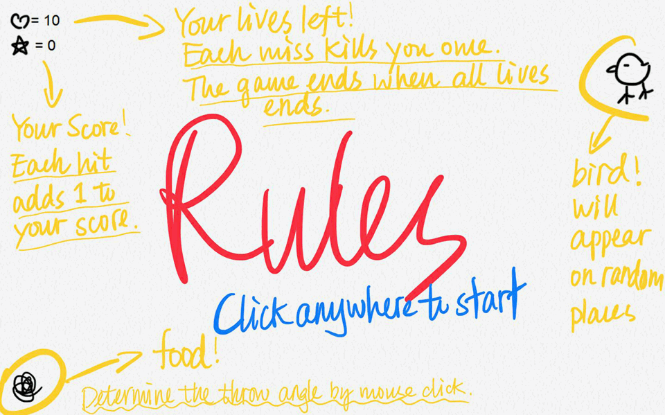

# Feed the Bird
Throw the food to feed the small adorable hungry chicken!

## Author
Walt Li

## Requirements
- Python3
- graphics.py (included in repo)

## Game Rules
This is basically a game that resembles basketball shooting, except that it is throwing food to a small adorable hungry chicken. 

The projectile is a parabola. The magnitude of the initial velocity is fixed in the program, and the player adjusts the angle of the shoot using mouse click. The program would show an animation of the food thrown to the chicken. The chicken will be delighted when the food falls onto it, but will show anger otherwise. 

On the upper left corner, the heart indicate the number of times you have left to make bad throws, and the start shows your score. After 10 fails, the game would end. The program would show the final score, which is the number of times the player successful feed the chicken.

## Known Issues
There's currently no known issues about the game. Since the graphics library is not optimal and the effects vary from computer to computer, the game will be re-written and improved in p5.js
